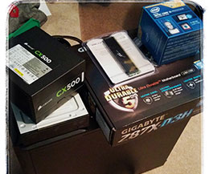

# Hackintosh Build Guide for OSX Mojave - 10.14

Having had to rebuild my system this past weekend I thought I would document my journey for my Hackinstosh. This guide is intended as a roadmap as a fresh install for my developer setup.

> Be kind to your future self

## My System Specs

- NZXT Tempest 210 case
- GIGABYTE GA-Z87X-D3H motherboard
- Intel Core i5-4670K Haswell 3.4GHz
- 16GB memory
- Corsair CX500 Power Supply
- 256 SSD and 1TB HD

Hard to believe [this build is over 4years old][googleplus] and is still running great. Hackintosh's are kinda picky on hw so make sure you choose wisely. [Tonymacx86 Buyers Guide][buyersguide] is a great resource to choose from guaranteed working builds.

## Step One: Bootable USB

1. You will need to have a copy of Mojave from the App store.

## Step Two: Clover

## Step Three: Install

## Step Four: Post-Install

## Step Five: Configuration

### Homebrew

### Git

### Terminal

### Editor

## Resources

[githubssh]: https://help.github.com/articles/connecting-to-github-with-ssh/
[nightowliterm]: https://github.com/nickcernis/iterm2-night-owl
[intel4600youtube]: https://www.youtube.com/watch?v=sL3JmGvbAxQ&t=47s
[mojaveinstallguide]: http://techhowdy.com/process-to-install-hackintosh-macos-mojave/
[alcsound]: https://www.reddit.com/r/hackintosh/comments/4e23w6/guide_native_audio_with_clover_applealckext/
[homebrewfonts]: https://github.com/Homebrew/homebrew-cask-fonts
[googleplus]: https://plus.google.com/+FrankPigeon/posts/H5Cm7CXGwxs
[buyersguide]: https://www.tonymacx86.com/buyersguide/building-a-customac-hackintosh-the-ultimate-buyers-guide/
